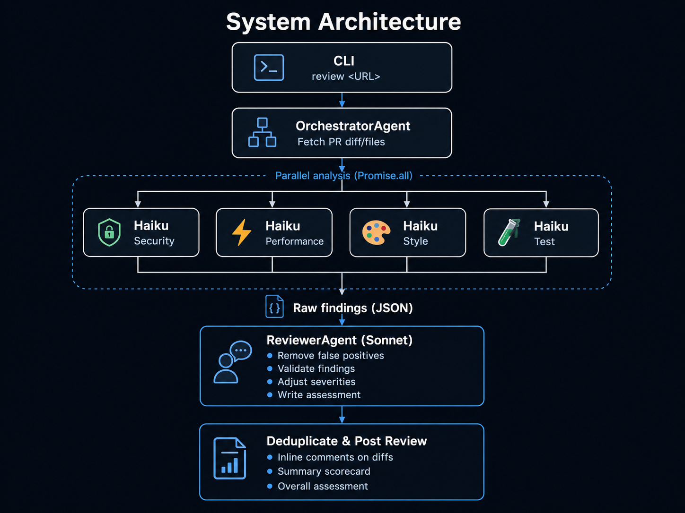

# multi-agent-pr-reviewer

A CLI tool that runs 4 specialized AI agents in parallel to review GitHub PRs, then passes findings through a final validation agent before posting inline comments and a summary scorecard.

```
npx review https://github.com/owner/repo/pull/42
```

## Architecture



**Key insight:** 4x Haiku agents process the large diffs in parallel at low cost, then a single Sonnet reviewer validates the small findings JSON for quality. This two-tier approach reduces token usage by ~60% vs. using Sonnet for all agents.

## Agents

| Agent | Focus | Model (default) |
|-------|-------|-----------------|
| 🔒 SecurityAgent | Hardcoded secrets, OWASP Top 10, injection risks | Haiku |
| ⚡ PerformanceAgent | N+1 queries, blocking I/O, memory leaks | Haiku |
| 🎨 StyleAgent | Naming, dead code, complexity, TypeScript types | Haiku |
| 🧪 TestAgent | Missing tests, edge cases, brittle assertions | Haiku |
| 📋 ReviewerAgent | Validates findings, removes false positives | Sonnet |

## Setup

```bash
git clone https://github.com/DS436/reviewbot-swarm.git
cd reviewbot-swarm
npm install
cp .env.example .env
# Edit .env and add your tokens
npm run build
```

## Configuration

Copy `.env.example` to `.env` and fill in:

```bash
GITHUB_TOKEN=ghp_yourtoken        # needs pull_requests: write
ANTHROPIC_API_KEY=sk-ant-yourkey

# Optional: override default models
AGENT_MODEL=claude-haiku-4-5      # 4 parallel agents (default)
REVIEWER_MODEL=claude-sonnet-4-6  # final validation (default)
```

### Model Options

**Default (recommended)** — Haiku agents + Sonnet reviewer:
```bash
AGENT_MODEL=claude-haiku-4-5
REVIEWER_MODEL=claude-sonnet-4-6
```
✨ Fast, ~60% cheaper than all-Sonnet. Best for most use cases.

**All Sonnet** — maximum quality:
```bash
AGENT_MODEL=claude-sonnet-4-6
REVIEWER_MODEL=claude-sonnet-4-6
```
Perfect for mission-critical reviews. Original behavior.

**All Haiku** — maximum speed/cost:
```bash
AGENT_MODEL=claude-haiku-4-5
REVIEWER_MODEL=claude-haiku-4-5
```
⚠️ Trade-off: more false positives, less overall assessment.

**Haiku agents + Opus reviewer** — highest final quality:
```bash
AGENT_MODEL=claude-haiku-4-5
REVIEWER_MODEL=claude-opus-4-7
```
Best false-positive filtering. More expensive on the reviewer pass.

## Usage

```bash
# After build
npx review https://github.com/owner/repo/pull/42

# During development
npm run dev -- https://github.com/owner/repo/pull/42
```

## Output

The tool posts a GitHub PR review with:
- **Inline comments** on diff lines, labeled by agent and severity
- **Summary scorecard** showing findings per agent and overall statistics
- **Overall assessment** from the reviewer agent
- **Additional findings** for lines not directly in the diff
- **Model info footer** showing which models were used

Example review body:

```
## 🤖 Multi-Agent PR Review

### Scorecard
| Agent | Findings |
|-------|----------|
| 🔒 SecurityAgent | 2 |
| ⚡ PerformanceAgent | 1 |
| 🎨 StyleAgent | 4 |
| 🧪 TestAgent | 1 |

---

### Summary
🔴 **1 critical** · 🟡 **5 warnings** · 🔵 **2 info** · **8 total**

---

### Overall Assessment
The PR introduces solid functionality with good test coverage, but has one critical 
security concern (hardcoded API key) and several style/perf optimizations worth addressing.

---

Agents: `claude-haiku-4-5` · Reviewer: `claude-sonnet-4-6`
```

Plus inline comments on each finding (one per diff line).

### Severity levels

| Emoji | Level | Meaning |
|-------|-------|---------|
| 🔴 | critical | Must fix before merge |
| 🟡 | warning | Should fix |
| 🔵 | info | Consider fixing |
